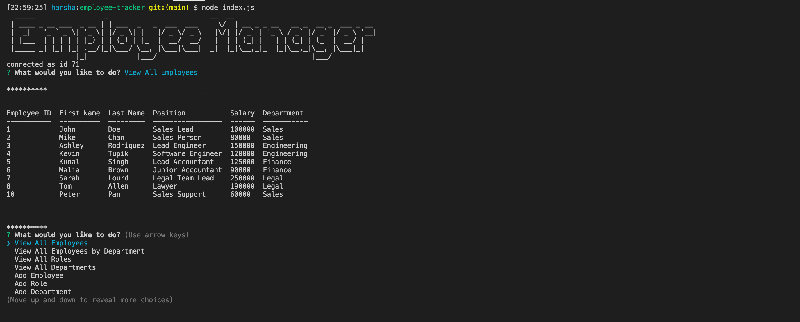

# employee-tracker

## Summary
In this assignment, we were tasked with creating a command line input program that would take in user input and dynamically access, update, and add to a stored database of employees for a company. 

## Instruction

Navigate to the following Github repository:
    https://github.com/hsaddanathan/employee-tracker.git

Across the top of the page, click on the Fork button on the right.

Once you have done this, you will see the repo copied within your Github account

Click the Green "Code" Button, and copy repo link. 

Open Terminal and run "git clone (Paste Link Here)"

Once repo has been cloned, you can run " code ." to open in Visual Studio Code. 

From there, open your terminal inside VS Code by using the keyboard shortcut "Ctrl + `. 

Next, type "npm install" to install dependencies.

Once you have done this, type "node index.js" to run the program and answer the prompts.

## Technology Used
    * node.js
    * Javascript
    * Inquirer
    * mySQL
    * Figlet

## Demo

## Links

employee-tracker repository link:
    https://github.com/hsaddanathan/employee-tracker.git

## Contributors 
[@hsaddanathan](https://github.com/hsaddanathan) 

## License
